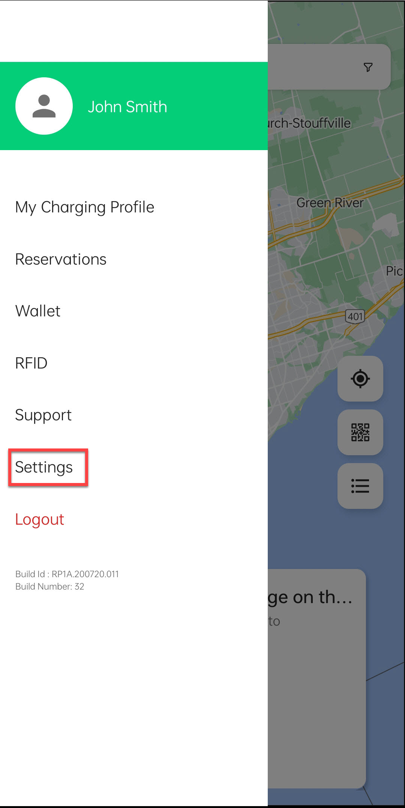
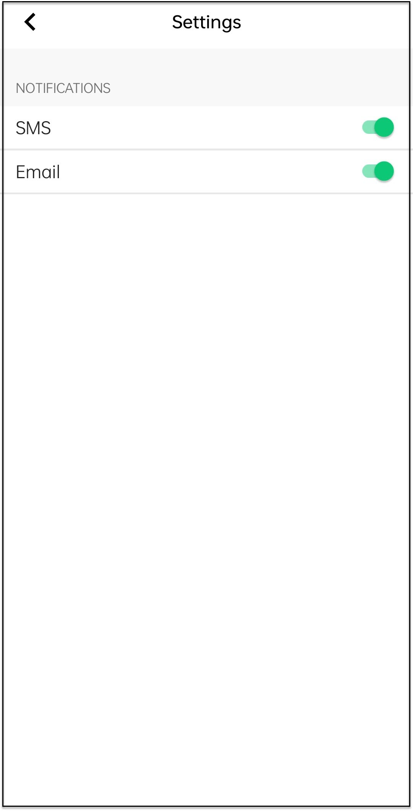

# Managing Settings

To enable or disable SMS and email notifications, follow these steps:

1. Click the **Settings** option in the main menu.

	

1. Use the toggle buttons to enable or disable the SMS notifications.

	