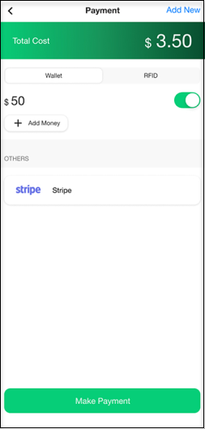

# Starting and Stopping Charging Session

1. Tap the **QR** button on the home screen. 

	

2. Using your mobile phone’s main camera, scan the QR sticker stuck on the charging station. 

	

3. Tap the **START CHARGING** button to initiate your charge session. 

	

4. The Charge Session screen displays real-time charging updates. To stop charging, tap on the **Stop Charging** button. 

	

5. Once your session ends, you will see your session details. Tap on the **Pay Now** button.

	

6. Tap the **Make Payment** button to pay for your charge session.

	

After you have paid for you charge session, don’t forget to rate your experience and provide your comments.
