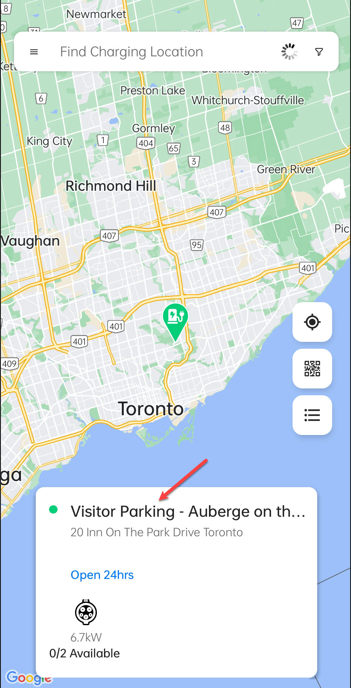
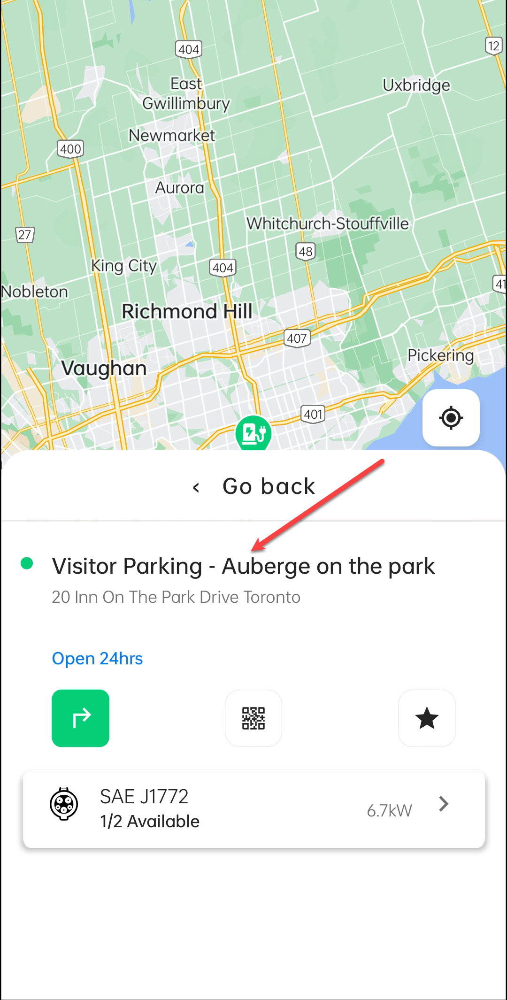
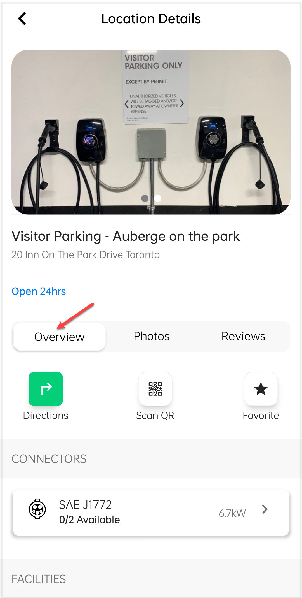

# Overview
The **Overview** screen under **Location Details** provides a summary of the charging station.

You can perform the following tasks:
- View driving directions.
- Scan the QR code to start charging your vehicle.
- Mark the location as a favorite.

To navigate to the Overview screen, follow these steps:
1. Tap on the location card.

	

2. Tap on the details card.

	

3. Tap on the **Overview** button.

	
