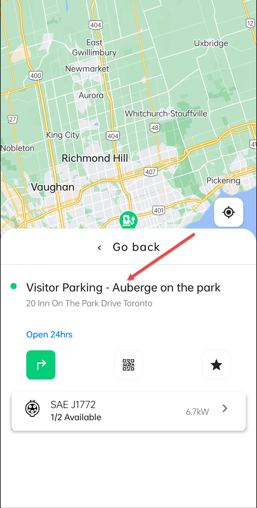

# Photos

The **Photos** screen under **Location Details** allows you to view images of the charging station and its surroundings. These images help you identify the station’s exact location, available charging points, and nearby facilities. 

To navigate to the Photos screen, follow these steps:

| 1. Tap on the location card. | 2. Tap on the details card. |   3. Tap on Photos.    |
| :--------------------------: | :-------------------------: | :--------------------: |
|        |       |  |