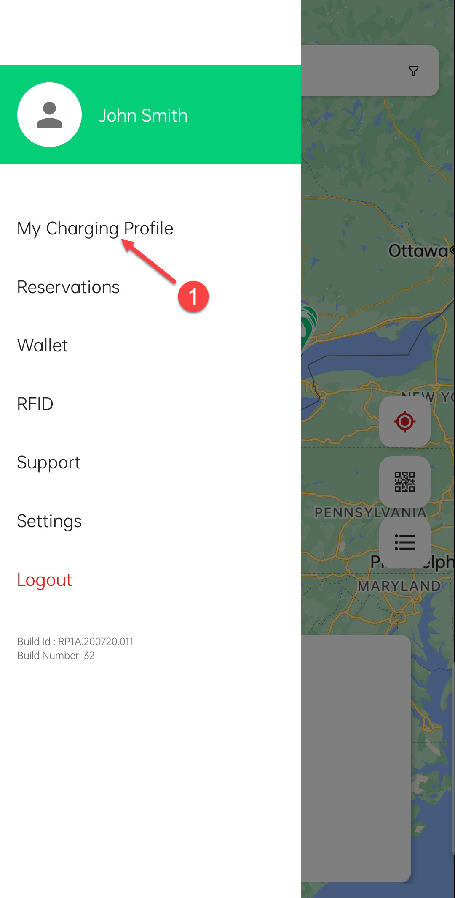

# Viewing Transactions and Invoices

The **Charging Profile** lists all your previous transactions and invoices. 

Click on any session to view additional details, such as charging duration, amount charged, and location. 

On this screen, you also have the option to reach out to support, email the invoice, or download the invoice for that specific charging session. This feature helps you keep track of your charging history and manage your receipts easily.

