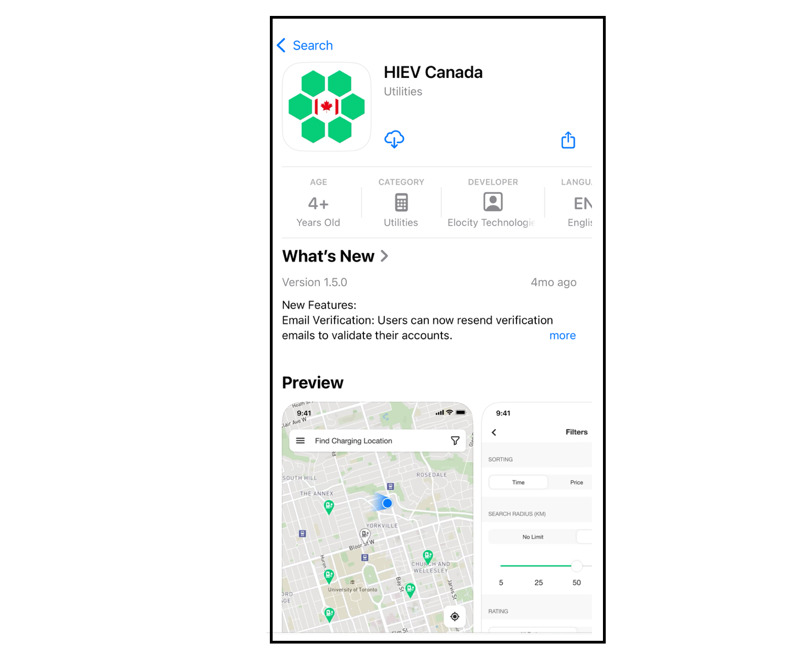

# Download

The **HIEV Canada** mobile app is available for both **iOS** and **Android** devices.

Follow the steps below to download and install the app on your smartphone or tablet.
## iOS (iPhone/iPad)

1. Open the **App Store** on your iOS device.
2. Tap the **Search** icon and type **HIEV Canada**.
3. Locate the app in the search results and tap **Get**.
4. If prompted, authenticate with **Face ID**, **Touch ID**, or your **Apple ID password**.
5. Wait for the installation to complete, then tap **Open** to launch the app.
## Android (Phones/Tablets)

1. Open the **Google Play Store** on your Android device.
2. Tap the **Search** bar and type **HIEV Canada**.
3. Select the app from the search results and tap **Install**.
4. Wait for the installation to finish, then tap **Open** to launch the app.

Alternatively, you can download the **HIEV Canada** mobile app for your device by scanning the respective QR code using your phone camera.

|       **App Store.**       |     **Google Play Store.**     |
| :------------------------: | :----------------------------: |
|  |  |

