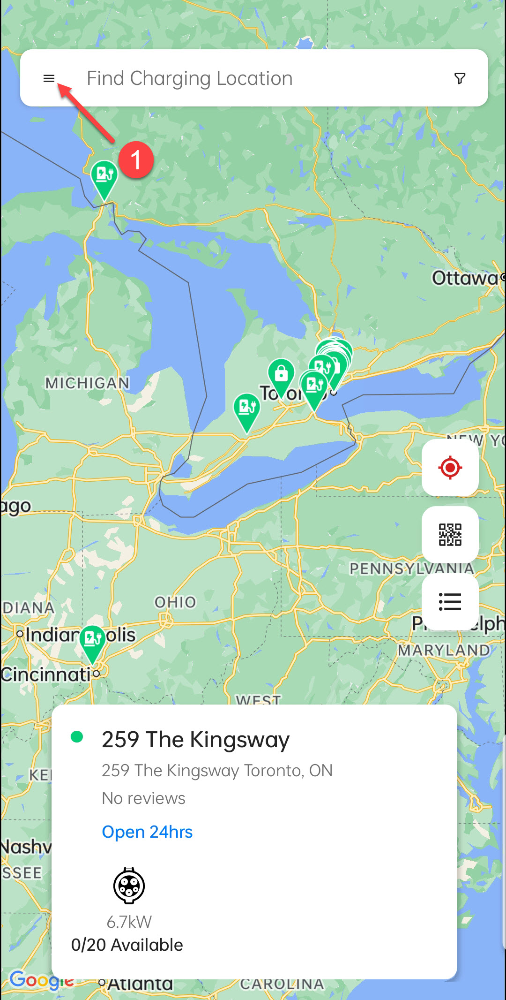
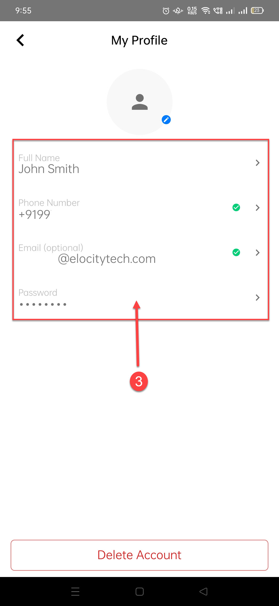

# Managing Profile

The **HIEV Canada** mobile app allows you to view and update your personal information. You can edit your name, phone number, email address, and password to keep your profile up to date. This section ensures that your account details remain accurate, enabling a seamless experience while accessing charging services and notifications.

To manage your profile, tap on the cards/buttons marked with arrows/numbers and make the desired changes.

|               1               |               2               |               3               |
| :---------------------------: | :---------------------------: | :---------------------------: |
|  |  |  |
:::note
You can also delete your profile by clicking on the **Delete Account** button.
:::