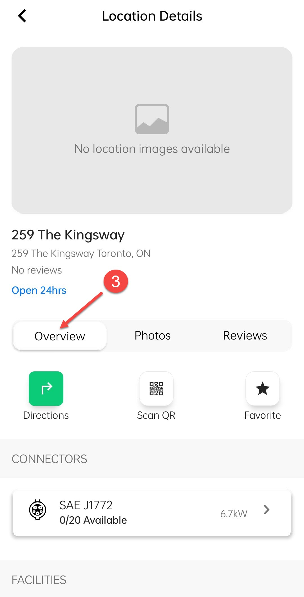

# Overview

The **Overview** screen under **Viewing Location Details** in the **HIEV Canada** mobile app provides a summary of the charging station. It includes key details such as the station name, availability status, and supported connector types. Users can quickly assess whether the station meets their charging needs before navigating to it.

In addition, users can get the driving directions, scan the QR code on the EV charging station to start charging, mark the location as a favorite, and view the list of facilities. They can also access important details such as the station’s address, operational timings, contact person, email, and phone number.

To navigate to the Overview screen, tap on the cards/buttons marked with arrows/numbers.

|           1            |           2            |           3            |
| :--------------------: | :--------------------: | :--------------------: |
|  |  |  |
