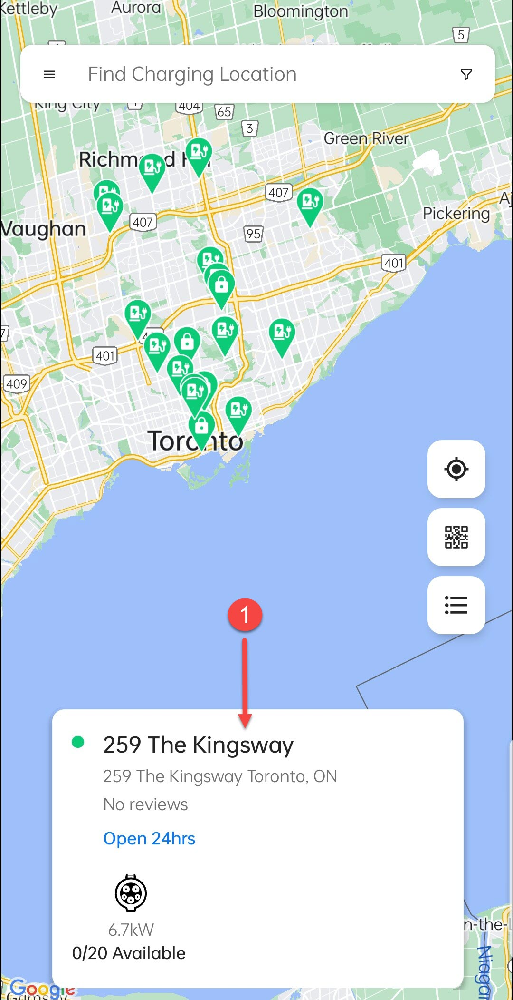
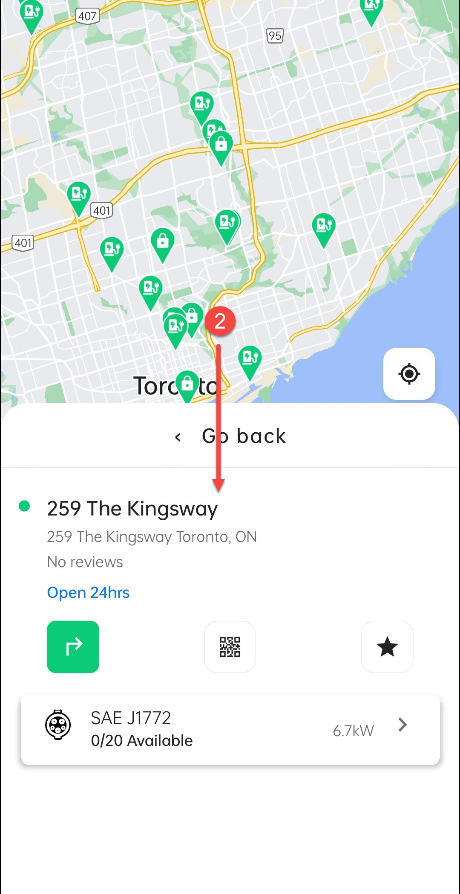
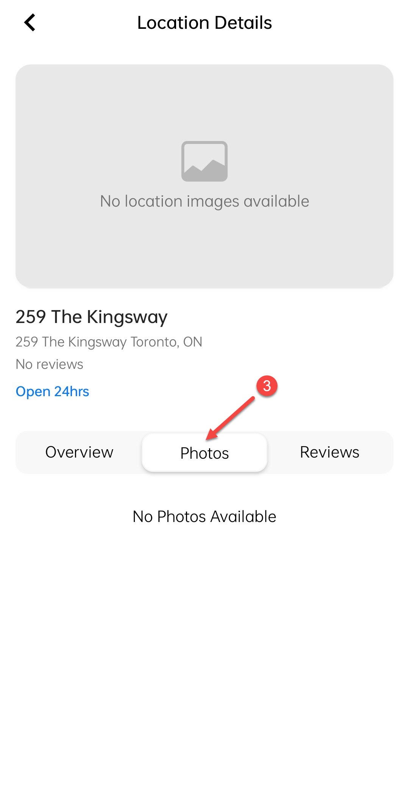

# Photos

The **Photos** screen under **Viewing Location Details** in the **HIEV Canada** mobile app allows users to view images of the charging station and its surroundings. These images help users identify the station’s exact location, available charging points, and nearby facilities. This feature enhances the user experience by providing visual context before arriving at the location.

To navigate to the Photos screen, tap on the cards/buttons marked with arrows/numbers.

|           1            |           2            |           3            |
| :--------------------: | :--------------------: | :--------------------: |
|  |  |  |
