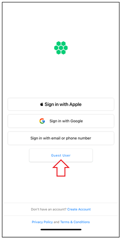

# Exploring App
You can explore the **HIEV Canada** mobile app without creating an account. 

Tap on the **Guest User** button to navigate through the app and get an overview of its functionality. 
### What You Can Do as a Guest

- **Browse Charging Stations** – View nearby charging stations and check availability.
- **Explore the App Interface** – Get familiar with the navigation, features, and layout.
- **Check Pricing and Details** – See charging rates, station details, and supported connectors.
- **View Public Charging Sessions** – Monitor real-time usage data for public stations.

To access full functionality, including starting a charging session and managing your EV profile, [sign up for an account](docs/UserGuide/iOS/CreatingAccount.md) or [sign in](docs/UserGuide/iOS/SigningIn.md).