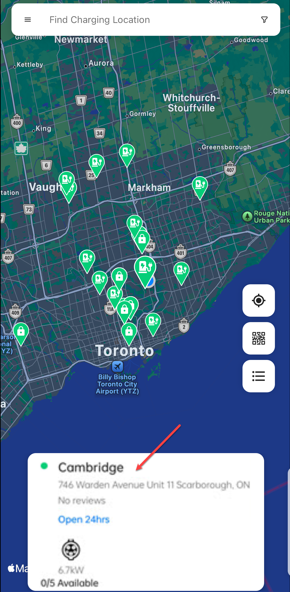
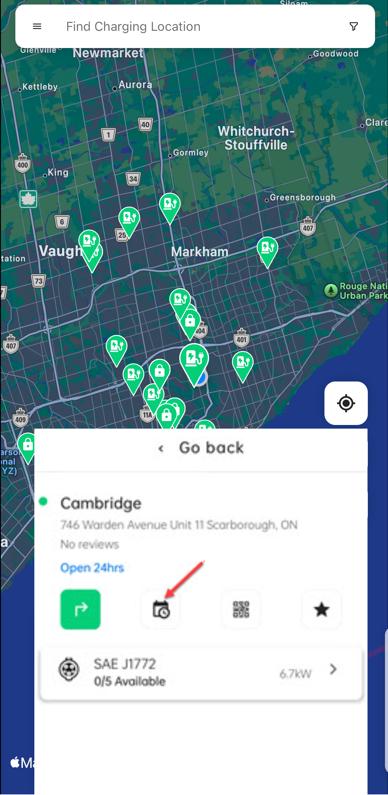

# Reserving a Charging Station
To reserve a charging station, follow these steps:
1. Search and tap on the location card.

	

2. Tap on the reservations icon.

	

3. Tap on the connector button.

	

4. Select a charging station.

	
5. Select the date and time duration.

	

6. Review your details and tap on the **Confirm** button.

	

The reservation details will appears under the [Upcoming Reservations](ViewingReservations) screen.