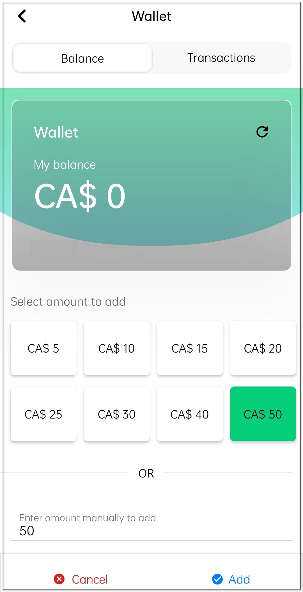
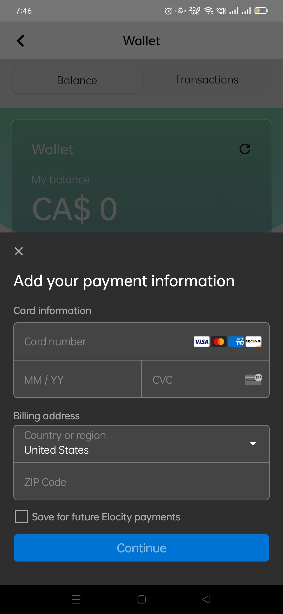

# Managing Wallet

Before charging your EV, make sure you have sufficient balance in your mobile app wallet.
1. Tap the **Menu** button on the home screen.

	

2. Tap on **Wallet**.

	

3. Tap on the **Add Money** button.

	

4. Select the amount to add or enter the amount manually. Then, tap on the **Add** button.

	

5. Add your payment information. Then, tap on the **Continue** button.

	

