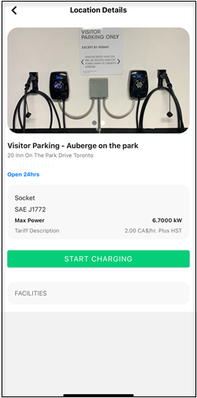

# Starting and Stopping Charging Session
1. Tap on the **QR** button.

	
2. Scan the QR sticker stuck on the charging station.

	
3. Tap on the **START CHARGING** button.

	

4. The Charge Session screen displays real-time charging updates. To stop charging, tap on the **STOP CHARGING** button.

	
5. Once your session ends, you will see your charge session and payment details. Tap on the **Pay Now** button.

	
6. Tap the **Make Payment** button to pay for your charge session.

	

7. After you have paid for you charge session, rate your experience and provide your comments. Then, tap on the **Submit** button.

	