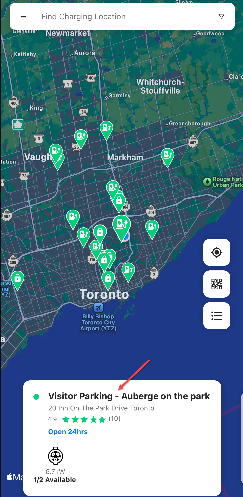
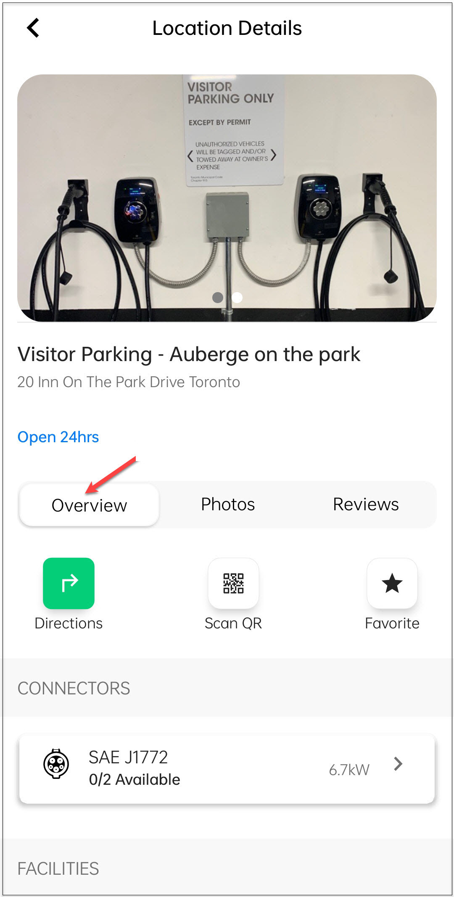

# Overview
The **Overview** screen under **Location Details** provides a summary of the charging station, which allows you to quickly assess whether the station meets your charging needs before navigating to it.

It includes the following details:
- Station name
- Availability status
- Supported connector types
- Station’s address
- Operational timings
- Contact person, email, and phone number

Additionally, you can perform the following tasks:
- View driving directions.
- Scan the QR code on the EV charging station to start charging.
- Mark the location as a favorite.

To navigate to the Overview screen, follow these steps:
1. Tap on the location card.

2. Tap on the details card.

3. Tap on the **Overview** button.

