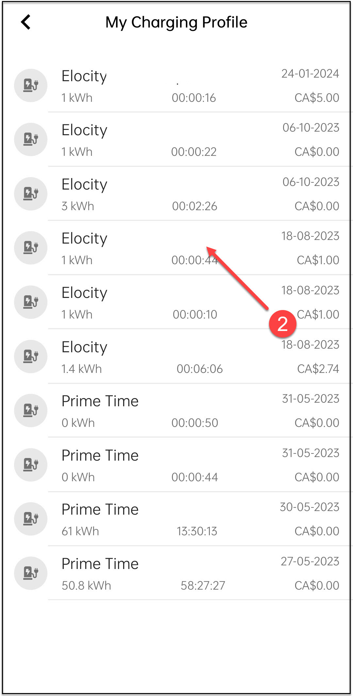
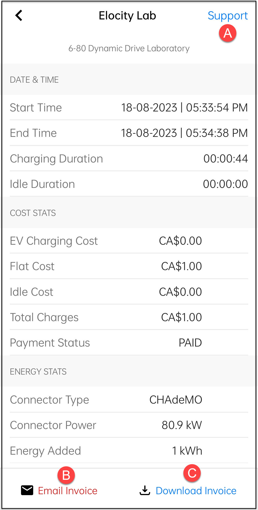

# Viewing Transactions and Invoices

In the **HIEV Canada** mobile app, the **Charging Profile** lists all your previous charging sessions. By clicking on any session, you can view additional details, such as charging duration, amount charged, and location. On this screen, you also have the option to reach out to support, email the invoice, or download the invoice for that specific charging session. This feature helps you keep track of your charging history and manage your receipts easily.

To view your charging profile, tap on the cards/buttons marked with arrows/numbers.

|               1               |               2               |               3               |
| :---------------------------: | :---------------------------: | :---------------------------: |
|  |  |  |