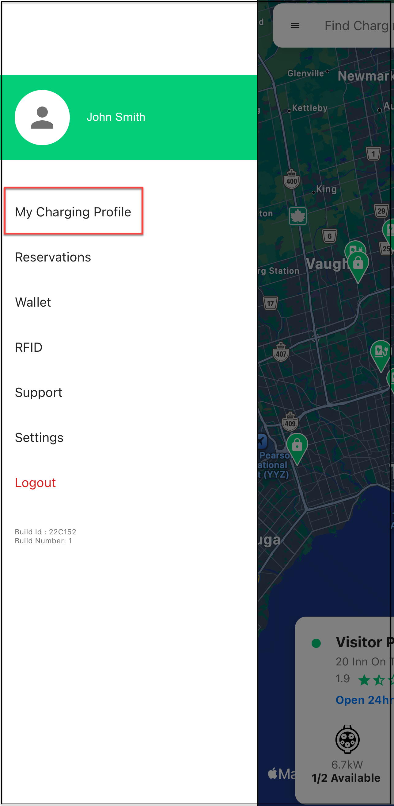

# Viewing Transactions and Invoices

To view your transactions and invoices, follow these steps:

1. Tap on the Menu button.

	

2. Tap on **My Charging Profile**.

	

2. Tap on any transaction.

	

3. You can perform the following tasks:
	- **A**. Reach out to support
	- **B**. Email invoice
	- **C**. Download invoice

	

